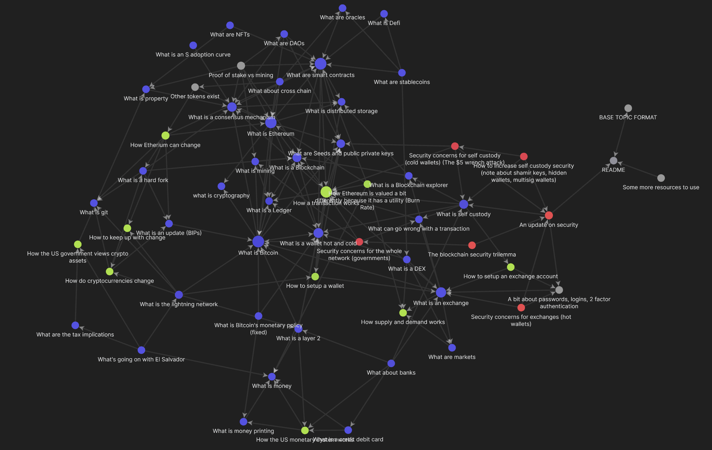

# Crypto Knowledge Map
 An Obsidian vault to hold the knowledge required to responsibly self custody your own crypto. 
 
 # How it Works
 This knowledge map is built around the Obsidian note taking software. You can find it at:
 https://obsidian.md/
 Obsidian is a fantastic note taking app that allows for the visualization of links between concepts. Its main special feature is the ability to view relationships between notes as an interactive graph. This greatly enhances the ability to see relations between concepts and explore a concept space. 
 
 
 
# How to Use and Improve
To use, fork and clone this git repository and open it as a vault from within Obsidian. That's it.

Please add links to useful references, add useful descriptions of topics, and add pull requests back to this repository so it can improve. The goal of this repo is to become a starting point for someone to learn about crypto, but also be able to expand with them as they want to incorporate more information. 

Go ahead and get started at [[A learning order]]

# Expected Base Format
You can find an example layout for a topic at [[BASE TOPIC FORMAT]].

To get a new section started simply copy and paste then edit to your liking. 

# Useful Tools
Most of the short summaries on each section are generated by OpenAI's [davinci-instruct-beta-v3](https://beta.openai.com/playground/p/default-grammar?model=davinci-instruct-beta-v3). 

A commonly used prompt was:

'''
We are trying to write short summaries on a topic. This is in the context of cryptocurrencies. Please write a paragraph on the following topic:
'''