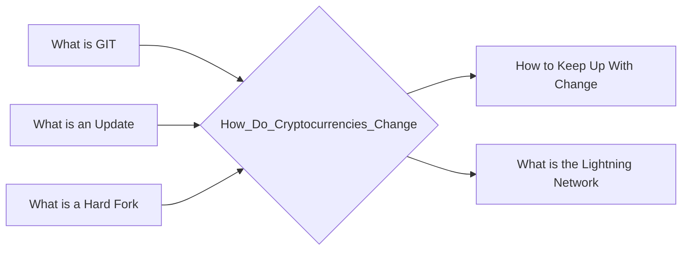

# Prerequisites
[[What_is_GIT]]

[[What_is_an_Update]]

[[What_is_a_Hard_Fork]]

# Subgraph

# Description
  
Cryptocurrencies are constantly changing with updates coming from the developers who create the currencies. For example the developers of Bitcoin Cash created a new update in November 2017 that changed the way the currency worked. This update was designed to make it easier for people to use Bitcoin Cash by making it faster and more efficient.

# Links
Links to other educational resources here:
