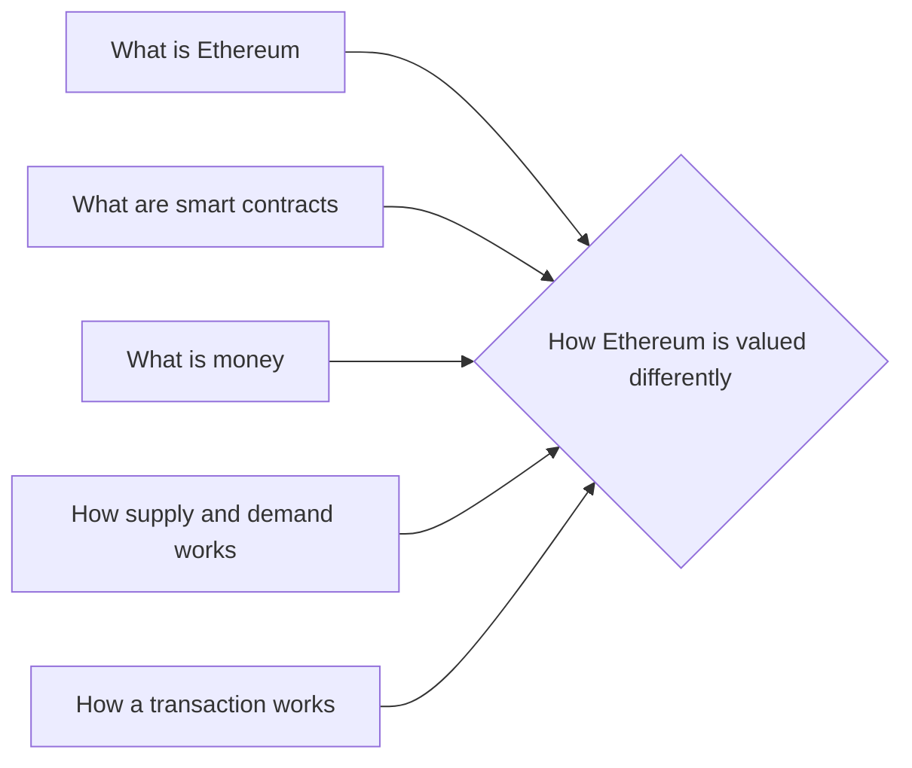

# Prerequisites
[[What_is_Ethereum]]

[[What_are_Smart_Contracts]]

[[What_is_Money]]

[[How_Supply_and_Demand_Works]]

[[How_a_Transaction_Works]]

# Subgraph

# Description
Ethereum is valued a bit differently than other cryptocurrencies because it has a utility. The Ethereum network has a burn rate which means that the value of Ethereum is based on its use rather than its supply and demand. This makes it a more stable investment than other cryptocurrencies. (Allegedly)

# Links
Links to other educational resources here: