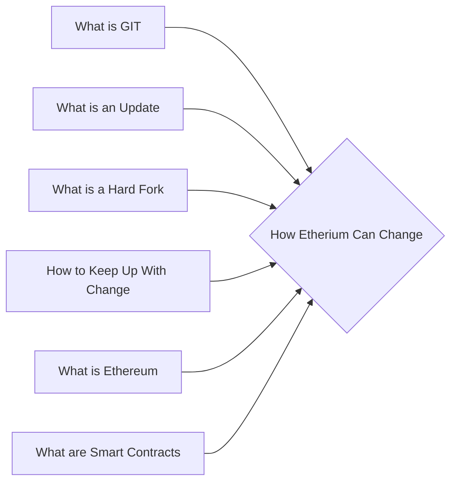

# Prerequisites
[[What_is_GIT]]

[[What_is_an_Update]]

[[What_is_a_Hard_Fork]]

[[How_to_Keep_Up_With_Change]]

[[What_is_Ethereum]]

[[What_are_Smart_Contracts]]

# Subgraph

# Description
  
Cryptocurrencies are constantly changing with new features and improvements being added all the time. This is done through a process called an EIP or Ethereum Improvement Proposal. (For Etherium BIP for Bitcoin) Anyone can submit an EIP and the community then votes on whether to implement it. This ensures that the best ideas are chosen and that the cryptocurrency remains as strong and reliable as possible.

# Links
Links to other educational resources here: