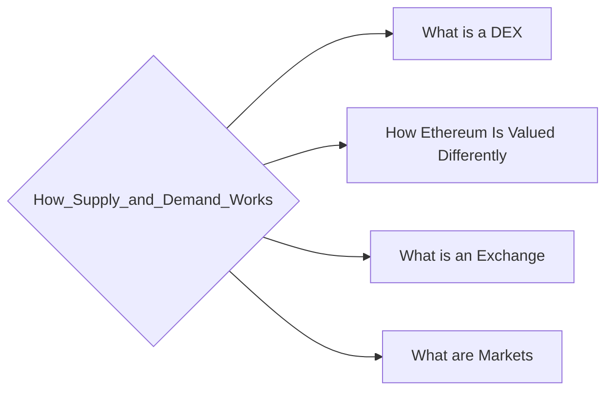

# Prerequisites
None

# Subgraph

# Description
  
Cryptocurrencies are created through a process called mining. Miners are rewarded with cryptocurrency for verifying and committing transactions to the blockchain. The number of cryptocurrency created is predetermined and decreases over time. The decrease in the number of cryptocurrency created is designed to match the increase in demand. As a result the supply and demand for cryptocurrency is in equilibrium.

# Exercises
- Look into supply and demand curves.
- Practice drawing a supply and demand curve graph. Just linear ones to start. 
- Practice shifting the supply curve and find the new price/quantity point. 
- Practice shifting the demand curve and find the new price/quantity point.
- Explore the differences between elastic and inelastic demand.

# Links
Links to other educational resources here:

An intro to supply and demand curves:
https://www.britannica.com/topic/supply-and-demand/Market-equilibrium-or-balance-between-supply-and-demand