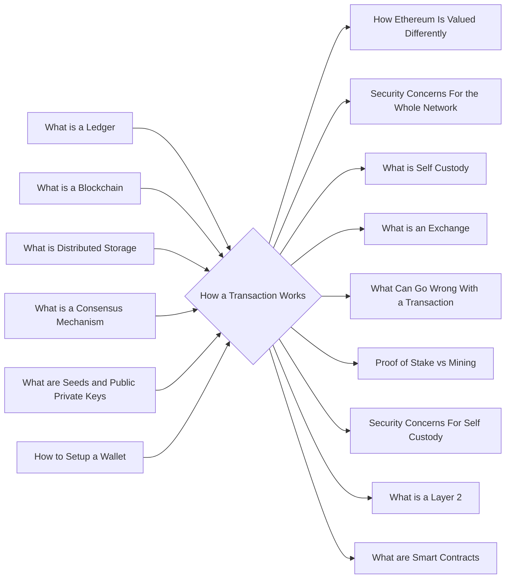

# Prerequisites
[[What_is_a_Ledger]]

[[What_is_a_Blockchain]]

[[What_is_Distributed_Storage]]

[[What_is_a_Consensus_Mechanism]]

[[What_are_Seeds_and_Public_Private_Keys]]

# Subgraph

# Description
A cryptocurrency transaction works by the sender sending a certain amount of cryptocurrency to a unique address on the blockchain. This is done by using a private key to sign a message with the funds that the sender wants to send. The recipient then can use the public key to unlock the funds.

# Links
Links to other educational resources here:
