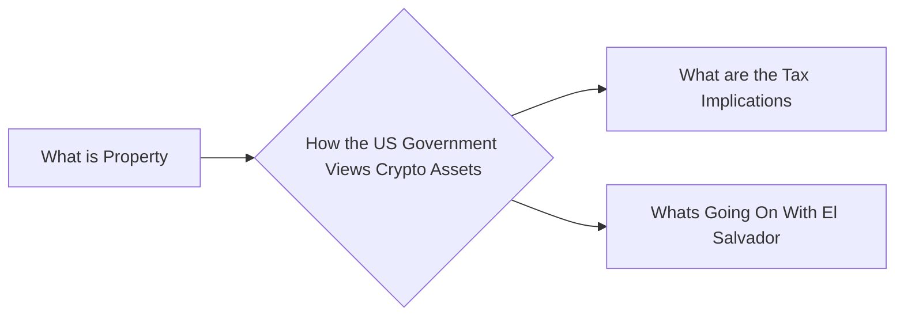

# Prerequisites
[[What_is_Property]]

# Subgraph

# Description

The US government views cryptocurrencies as property. This is because they are not considered to be currency. The government believes that cryptocurrencies should be taxed as property because they are not considered to be money.

# Links
Links to other educational resources here: