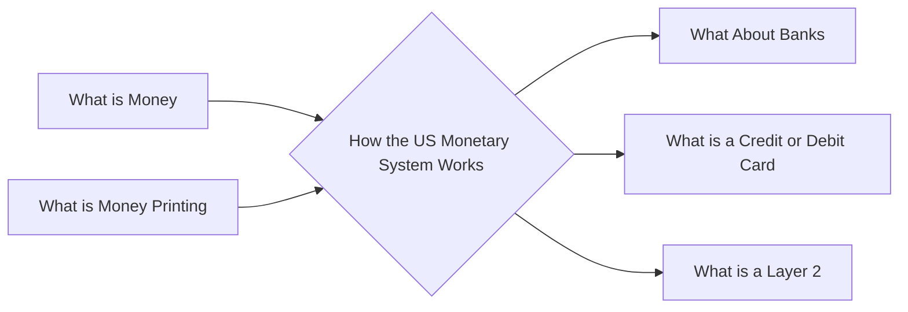

# Prerequisites
[[What_is_Money]]

[[What_is_Money_Printing]]

# Subgraph

# Description
  
The monetary system in the United States is based on fiat currency. The US dollar is the primary currency and it is used to buy goods and services both in the US and around the world. The monetary system is regulated by the Federal Reserve which is responsible for issuing currency setting interest rates and managing the money supply. The Federal Reserve also oversees the banking system in the US.

# Links
Links to other educational resources here:

