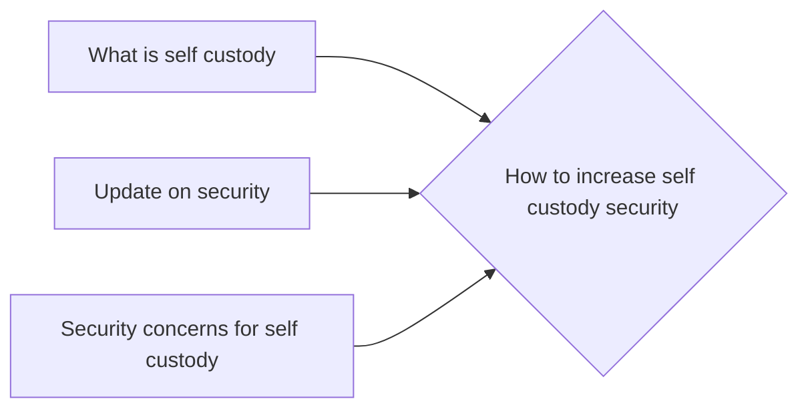

# Prerequisites
[[What_is_Self_Custody]]

[[Update_On_Security]]

[[Security_Concerns_For_Self_Custody]]

# Subgraph

# Description
  
There are a few things that can be done to increase the security of a self-custodied cryptocurrency wallet. One is to use shamir keys to split the wallet into multiple parts each held by a different person. Another is to use a hidden wallet to store a portion of the funds which can only be accessed with a special password. And finally using a multisig wallet can also help to secure the funds because multiple people have to authorize transactions.

# Links
Links to other educational resources here: