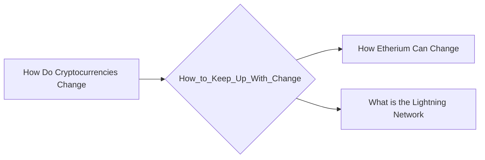

# Prerequisites
[[How_Do_Cryptocurrencies_Change]]

# Subgraph

# Description
  
Cryptocurrencies are constantly changing so it is important to keep up with the latest news and developments in order to make informed investment decisions. There are a number of ways to do this including subscribing to newsletters following cryptocurrency experts on social media and attending conferences.

# Links
Links to other educational resources here: