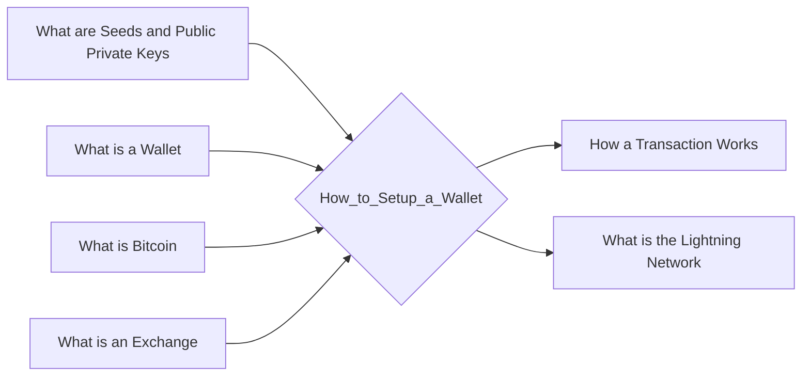

# Prerequisites
[[What_are_Seeds_and_Public_Private_Keys]]

[[What_is_a_Wallet]]

[[What_is_Bitcoin]]

[[What_is_an_Exchange]]

# Subgraph

# Description
  
To setup a wallet you will need to create an account with a cryptocurrency exchange. Once you have created an account you will need to deposit funds into your account. You can then use the funds to purchase a cryptocurrency. Once you have purchased a cryptocurrency you will need to download a wallet to store the cryptocurrency. You can then use the wallet to send and receive payments.

# Links
Links to other educational resources here: