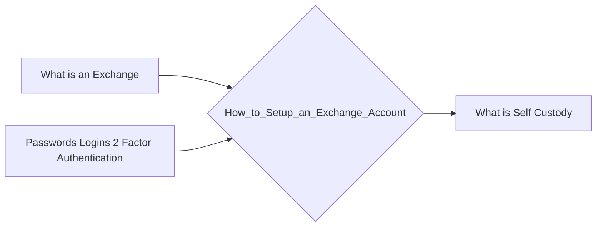

# Prerequisites
[[What_is_an_Exchange]]

[[Passwords_Logins_2_Factor_Authentication]]

# Subgraph

# Description
  
To setup an exchange account you will need to provide your name email and country. You will also need to create a password and select a currency. Once you have registered you will need to verify your account by providing your phone number and ID. This process is called KYC (Know Your Customer) and is required by law in most countries.

# Links
Links to other educational resources here: