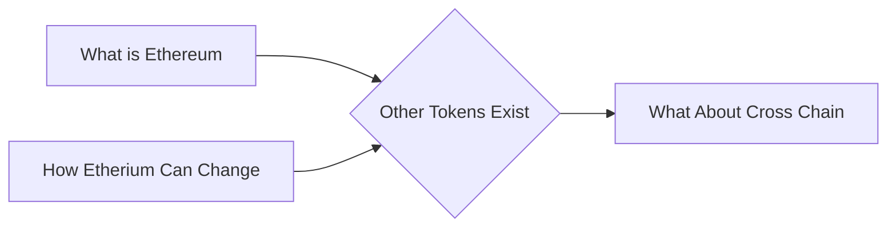

# Prerequisites
[[What_is_Ethereum]]

[[How_Etherium_Can_Change]]

# Subgraph

# Description
  
There are a variety of other tokens that exist in the cryptocurrency market outside of Bitcoin and Ethereum. These tokens include Litecoin Ripple and Dash among others. Each of these tokens has its own unique features and benefits that make it appealing to investors and traders. For example Litecoin is known for being faster and cheaper to use than Bitcoin while Ripple is focused on providing fast and secure transactions.

# Links
Links to other educational resources here: