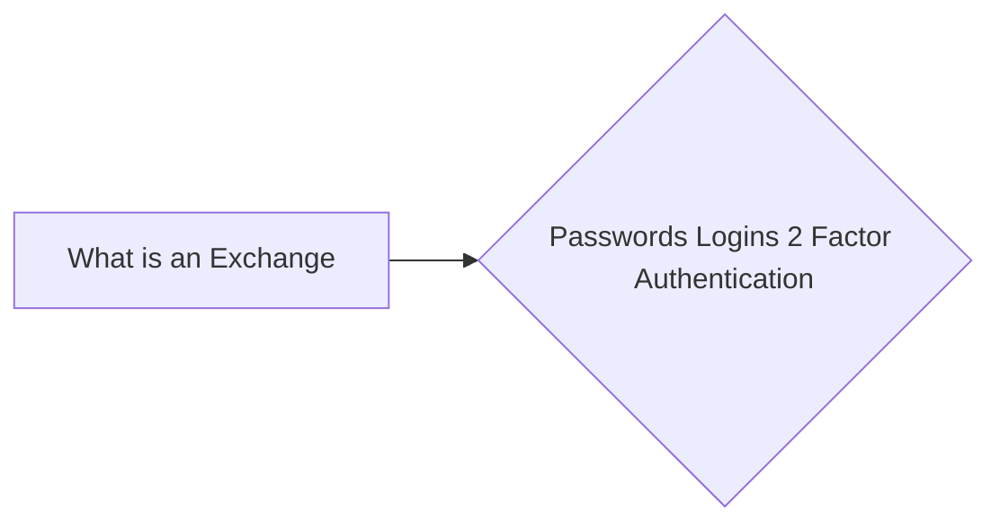

# Prerequisites
[[What_is_an_Exchange]]

# Subgraph

# Description
A password is a secret word or phrase that is used to control access to a computer system program or data. Passwords are used to authenticate users. A login is the name used to identify a user and their password. A two-factor authentication (2FA) system requires two pieces of information to authenticate a user: a password and a second factor such as a security token or a one-time password. It is recommend to at a minimum use 2FA on exchange logins. 

# Links
Links to other educational resources here: