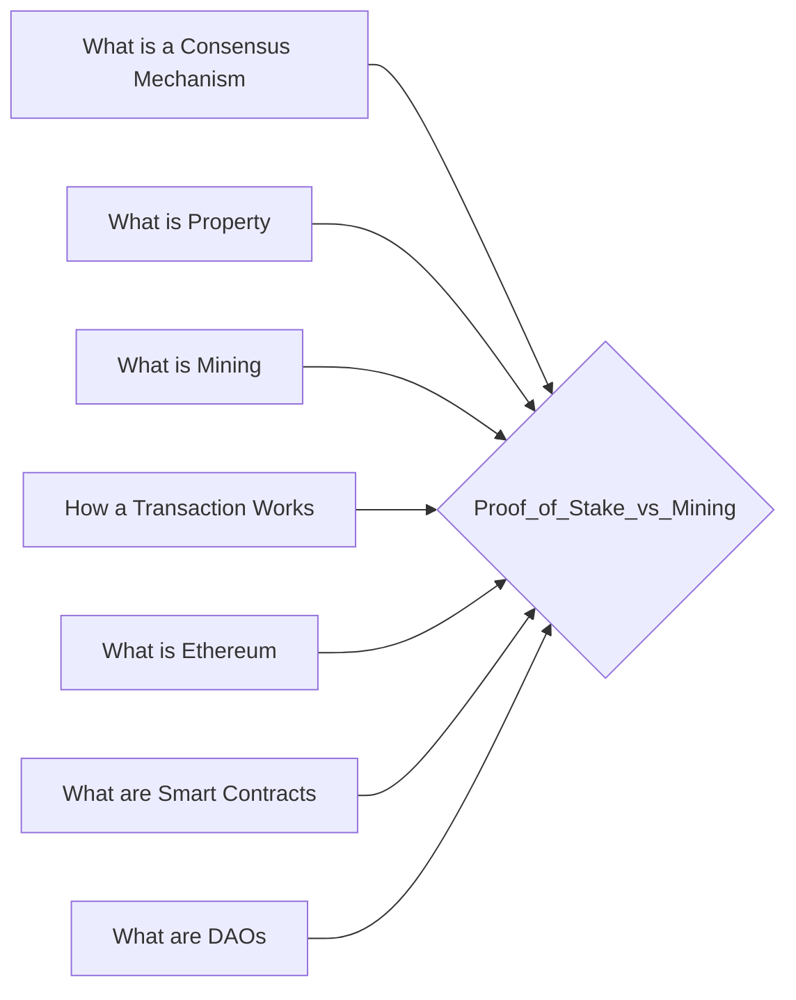

# Prerequisites
[[What_is_a_Consensus_Mechanism]]

[[What_is_Property]]

[[What_is_Mining]]

[[How_a_Transaction_Works]]

[[What_is_Ethereum]]

[[What_are_Smart_Contracts]]

[[What_are_DAOs]]

# Subgraph

# Description
  
Proof of stake is a different way of verifying transactions and securing the blockchain. In proof of stake users "stake" their coins by locking them up for a period of time. 

# Links
Links to other educational resources here:
