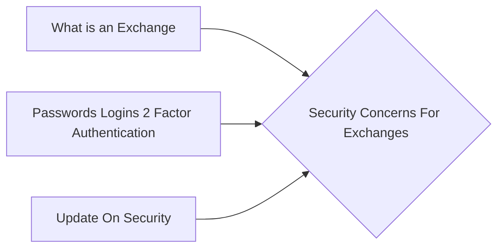

# Prerequisites
[[What_is_an_Exchange]]

[[Passwords_Logins_2_Factor_Authentication]]

[[Update_On_Security]]

# Subgraph

# Description
  
Cryptocurrency exchanges are a popular target for hackers due to the large sums of money stored in their hot wallets. Many exchanges have been hacked in the past resulting in millions of dollars worth of losses. In order to protect their funds users are advised to use a 2-factor authentication (2FA) and to store their cryptocurrencies in a cold wallet.

A cold wallet is a cryptocurrency wallet that is not connected to the internet. This means that it is not possible for someone to hack into it and steal the users funds. A hot wallet on the other hand is a cryptocurrency wallet that is connected to the internet. This means that it is possible for someone to hack into it and steal the users funds.

# Links
Links to other educational resources here: