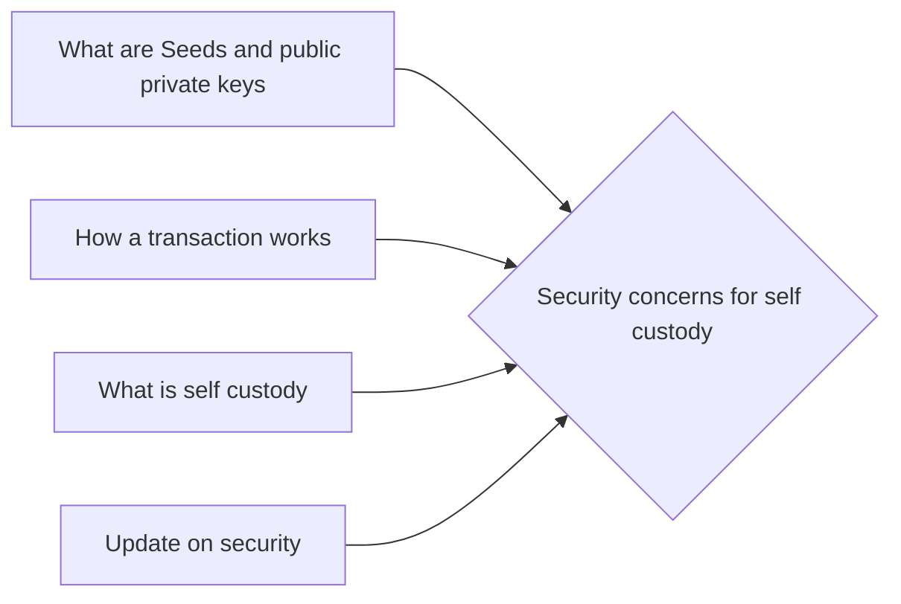

# Prerequisites
[[What_are_Seeds_and_Public_Private_Keys]]

[[How_a_Transaction_Works]]

[[What_is_Self_Custody]]

[[Update_On_Security]]

# Subgraph

# Description
  
Security concerns for self custody (cold wallets) arise from the fact that if a users computer is compromised the thief would have access to the users entire wallet and could steal all of the cryptocurrency. One solution to this problem is to use a hardware wallet which is a physical device that stores the users private keys. Another solution is to use a paper wallet which is a document that contains the users private keys.

# Links
Links to other educational resources here:
