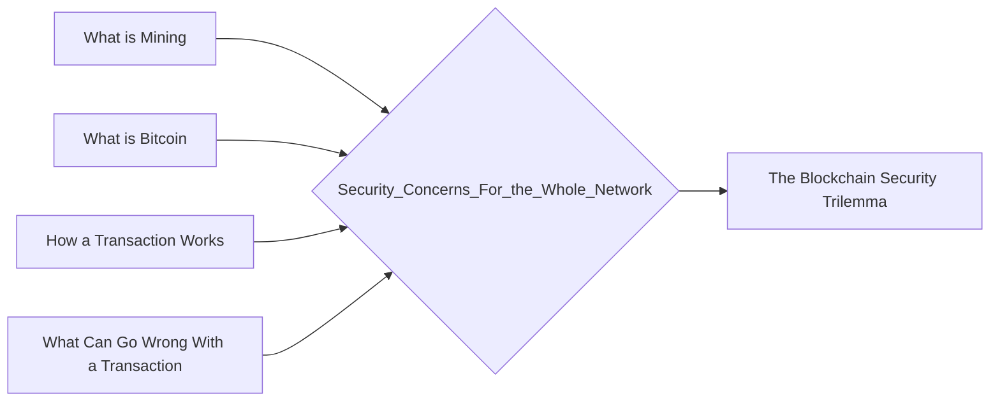

# Prerequisites
[[What_is_Mining]]

[[What_is_Bitcoin]]

[[How_a_Transaction_Works]]

[[What_Can_Go_Wrong_With_a_Transaction]]

# Subgraph

# Description
  
Cryptocurrencies are digital or virtual tokens that use cryptography to secure their transactions and to control the creation of new units. While cryptocurrencies are often seen as a way to evade government regulation and control their security and the security of the whole network is a concern for governments. Cryptocurrencies are often held by individuals and traded on exchanges and can be used to purchase goods and services. As they become more popular and more widely used governments are increasingly interested in their regulation and control.

# Links
Links to other educational resources here: