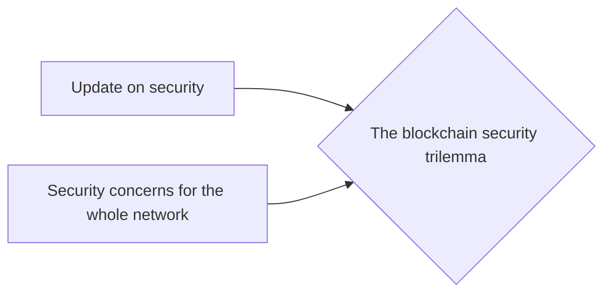

# Prerequisites
[[Update_On_Security]]

[[Security_Concerns_For_the_Whole_Network]]

# Subgraph

# Description
  
The blockchain security trilemma is a term used to describe the inherent trade-offs between security decentralization and scalability of blockchains. It states that it is impossible to have all three properties simultaneously and that blockchains must choose two out of the three.

# Links
Links to other educational resources here: