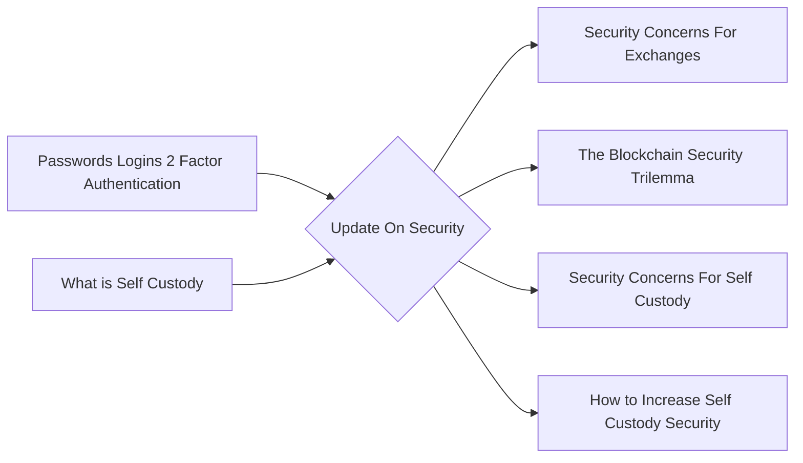

# Prerequisites
[[Passwords_Logins_2_Factor_Authentication]]

[[What_is_Self_Custody]]

# Subgraph

# Description
  
Cryptocurrencies are digital or virtual tokens that use cryptography to secure their transactions and to control the creation of new units. Cryptocurrencies are decentralized meaning they are not subject to government or financial institution control. While this freedom offers many advantages it also leaves cryptocurrencies vulnerable to theft. Cryptocurrency exchanges and wallets are frequently hacked and individual investors are often the target of phishing scams. In order to protect your cryptocurrency investments it is important to be mindful of security processes. 

# Links
Links to other educational resources here:
