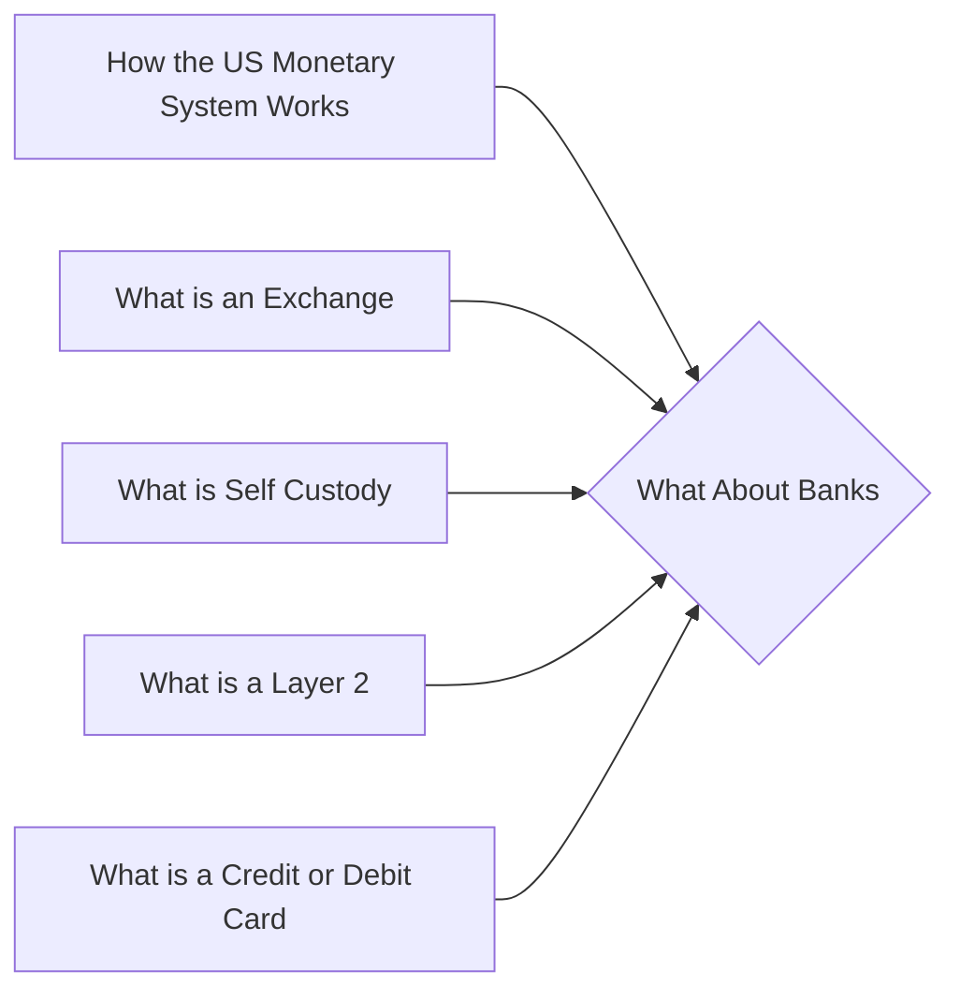

# Prerequisites
[[How_the_US_Monetary_System_Works]]

[[What_is_an_Exchange]]

[[What_is_Self_Custody]]

[[What_is_a_Layer_2]]

[[What_is_a_Credit_or_Debit_Card]]

# Subgraph

# Description
  
Cryptocurrencies are digital or virtual tokens that use cryptography to secure their transactions and to control the creation of new units. Cryptocurrencies are decentralized meaning they are not subject to government or financial institution control. This makes them attractive to many users who distrust banks and other centralized financial institutions.

# Links
Links to other educational resources here: