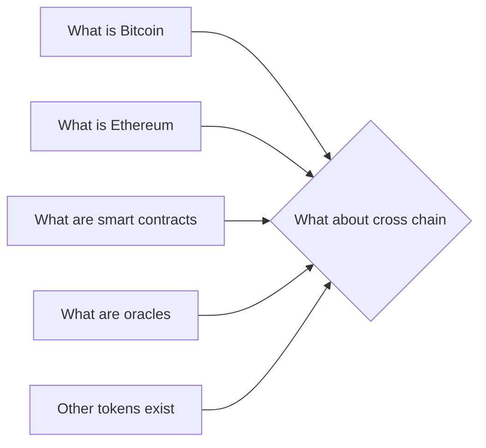

# Prerequisites
[[What_is_Bitcoin]]

[[What_is_Ethereum]]

[[What_are_Smart_Contracts]]

[[What_are_Oracles]]

[[Other_Tokens_Exist]]

# Subgraph

# Description
Cross chain refers to the ability of different blockchains to interact with each other. This allows for the transfer of assets between different blockchains and can be used to create decentralized exchanges.

# Links
Links to other educational resources here: