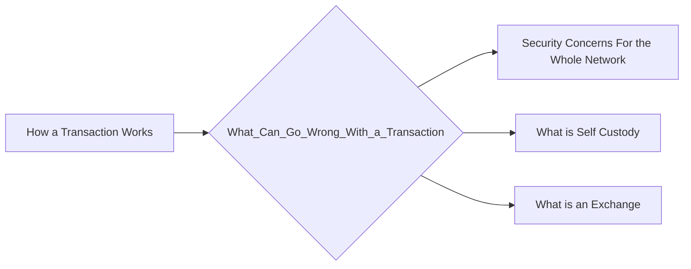

# Prerequisites
[[How_a_Transaction_Works]]

# Subgraph

# Description
  
Cryptocurrency transactions are irreversible and can be difficult to track. This can lead to problems if something goes wrong with a transaction. For example if someone sends cryptocurrency to the wrong address the funds may be lost permanently. Additionally cryptocurrency transactions can be used for fraud or money laundering.

If a transaction is not tipped properly the miners may not include it in the blockchain. This could be due to a lack of funds or because the transaction is invalid.

# Links
Links to other educational resources here: