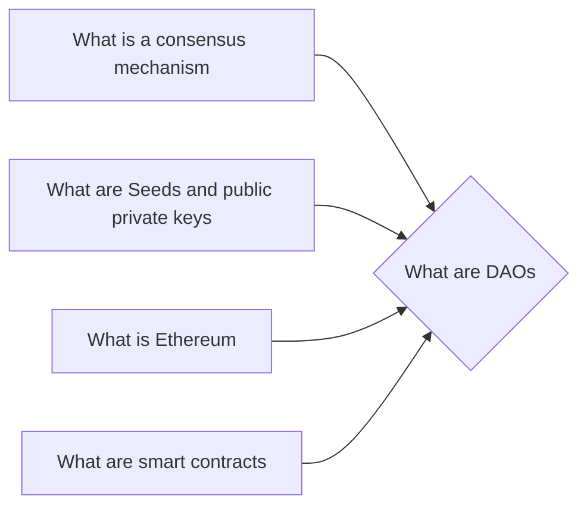

# Prerequisites
[[What_is_a_Consensus_Mechanism]]

[[What_are_Seeds_and_Public_Private_Keys]]

[[What_is_Ethereum]]

[[What_are_Smart_Contracts]]

# Subgraph

# Description
  
A DAO is a Decentralized Autonomous Organization. It is a self-governing organization that is run by its members who vote on proposals and decisions. DAOs are powered by blockchain technology and are often used to raise funds for new projects.

# Links
Links to other educational resources here: