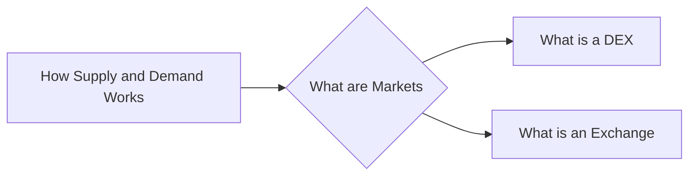

# Prerequisites
[[How_Supply_and_Demand_Works]]

# Subgraph

# Description
  
Marketplaces are where buyers and sellers interact to exchange goods and services. Cryptocurrency markets are digital marketplaces where buyers and sellers exchange cryptocurrencies. Cryptocurrency exchanges are the most common type of marketplaces in the cryptocurrency world. They are where buyers and sellers meet to exchange cryptocurrencies for other cryptocurrencies or for fiat currencies like the US dollar.

# Links
Links to other educational resources here:
