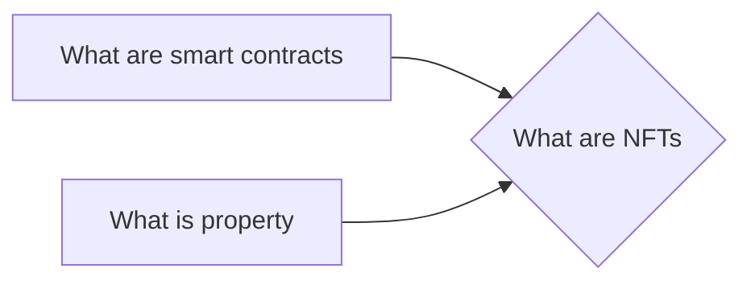

# Prerequisites
[[What_are_Smart_Contracts]]

[[What_is_Property]]

# Subgraph

# Description
  
Non-fungible tokens (NFTs) are a type of cryptocurrency that represents unique digital assets. These tokens can be used to represent anything from virtual goods to real-world assets. NFTs are different from other cryptocurrencies because each token is unique and cannot be replaced by another. This makes them ideal for representing digital assets that have value such as collectibles or digital art.

# Links
Links to other educational resources here: