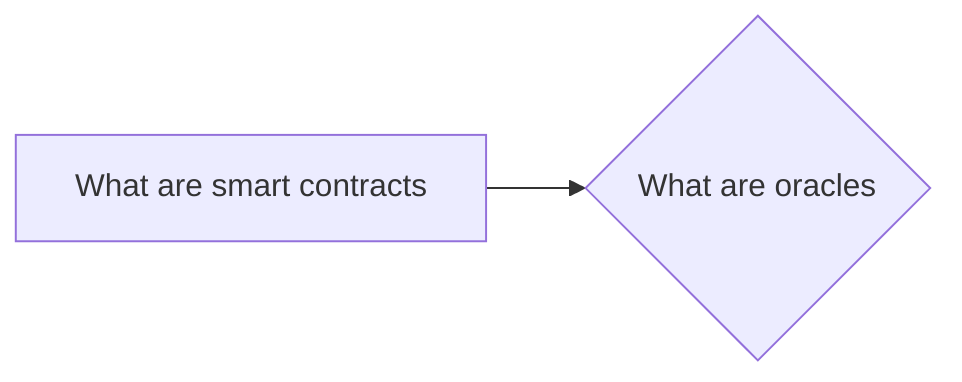

# Prerequisites
[[What_are_Smart_Contracts]]

# Subgraph

# Description
  
Oracles are entities that provide information to oracles contracts. These contracts are then able to make decisions based on the information provided by the oracles. Oracles can be used for a variety of purposes such as verifying the authenticity of data or determining the outcome of a bet.

# Links
Links to other educational resources here: