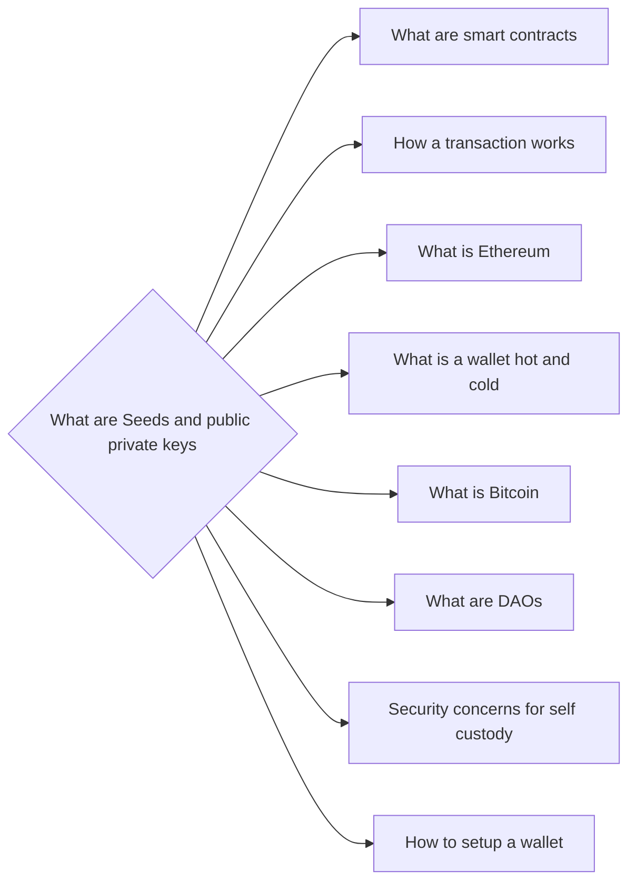

# Prerequisites
None

# Subgraph

# Description
A seed is a random set of words that is used to generate a bitcoin address and private key. The seed can be used to regenerate the private key if it is lost. A public key is the address that is used to receive bitcoin and a private key is the secret key that is used to send bitcoin.

# Links
Links to other educational resources here: