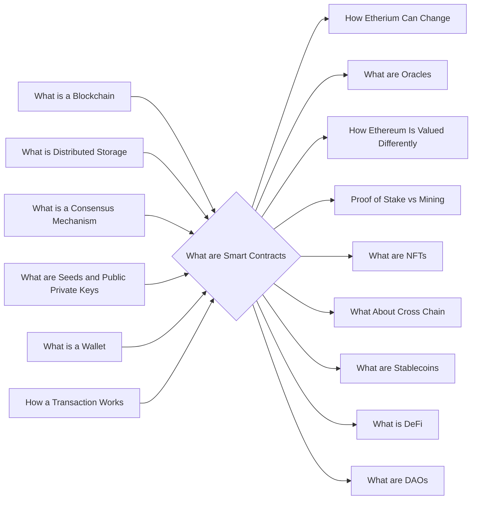

# Prerequisites
[[What_is_a_Blockchain]]

[[What_is_Distributed_Storage]]

[[What_is_a_Consensus_Mechanism]]

[[What_are_Seeds_and_Public_Private_Keys]]

[[What_is_a_Wallet]]

[[How_a_Transaction_Works]]

# Subgraph

# Description
A smart contract is a computer protocol intended to digitally facilitate verify or enforce the negotiation or performance of a contract. Smart contracts allow the performance of credible transactions without third parties. These transactions are traceable and irreversible.

# Links
Links to other educational resources here: