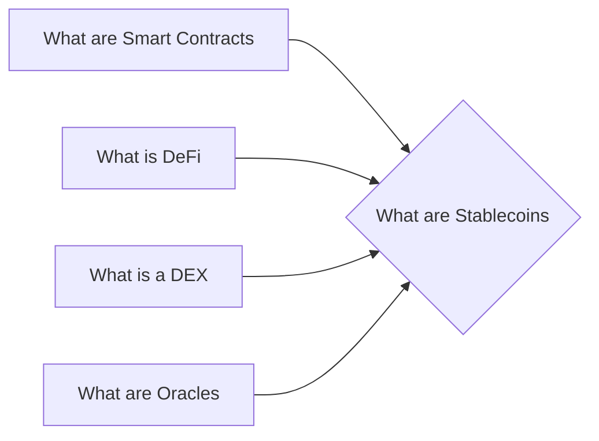

# Prerequisites
[[What_are_Smart_Contracts]]

[[What_is_DeFi]]

[[What_is_a_DEX]]

[[What_are_Oracles]]

# Subgraph

# Description
A stablecoin is a cryptocurrency that is pegged to another asset usually fiat currency. This allows for a more stable value for the coin as opposed to cryptocurrencies that can be subject to large price swings. There are a number of different stablecoins in circulation but the most popular is Tether which is pegged to the US dollar.

# Links
Links to other educational resources here: