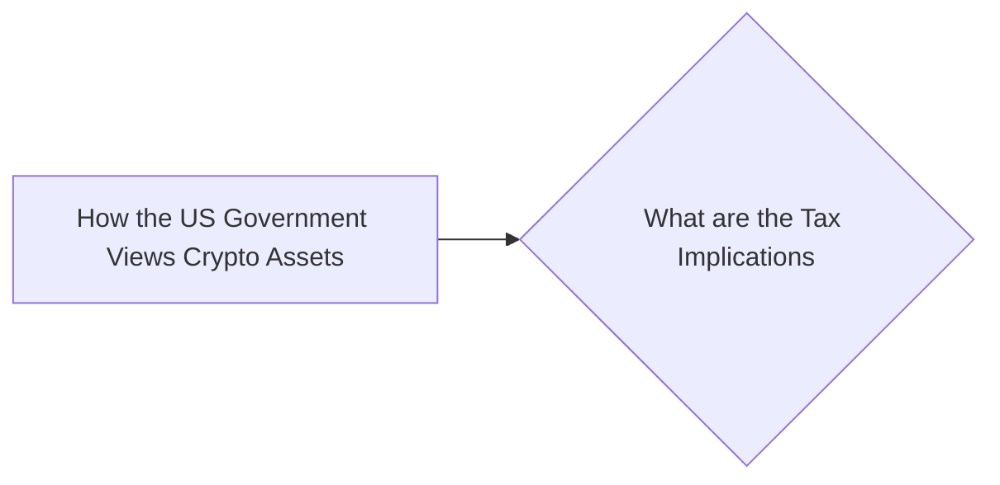

# Prerequisites
[[How_the_US_Government_Views_Crypto_Assets]]

# Subgraph

# Description
  
Cryptocurrencies are considered property for tax purposes in the United States. This means that any gains or losses from cryptocurrency transactions are taxable. For example if you buy a cryptocurrency for 1000 and sell it for 1500 you would have to report a 500 gain on your taxes. If you buy a cryptocurrency for 1000 and sell it for 500 you would have to report a 500 loss on your taxes.

# Links
Links to other educational resources here:
