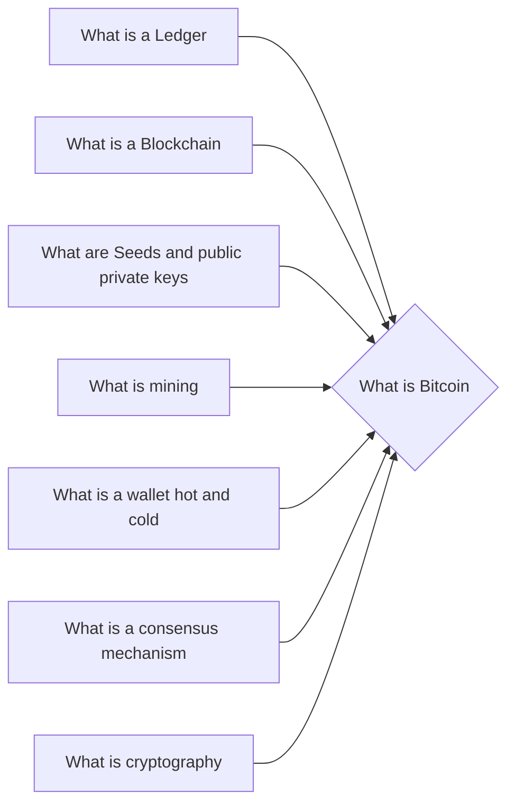

# Prerequisites
[[What_is_a_Ledger]]

[[What_is_a_Blockchain]]

[[What_are_Seeds_and_Public_Private_Keys]]

[[What_is_Mining]]

[[What_is_a_Wallet]]

[[What_is_a_Consensus_Mechanism]]

[[What_is_Cryptography]]

# Subgraph

# Description
Bitcoin is a cryptocurrency and a payment system first proposed by an anonymous person or group of people under the name Satoshi Nakamoto in 2008. Transactions are verified by network nodes through cryptography and recorded in a public dispersed ledger called a blockchain. Bitcoin is unique in that there are a finite number of them: 21 million. Bitcoins are created as a reward for a process known as mining. They can be exchanged for other currencies products and services. As of February 2015 over 100

# Links
Links to other educational resources here:

Bitcoin GitHub Repository: https://github.com/bitcoin
