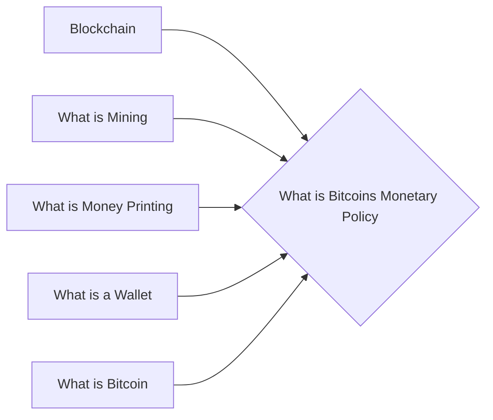

# Prerequisites
[[Blockchain]]

[[What_is_Mining]]

[[What_is_Money_Printing]]

[[What_is_a_Wallet]]

[[What_is_Bitcoin]]

# Subgraph

# Description
  
Bitcoins monetary policy is fixed in that there is a finite number of bitcoins that will ever be created. This means that the value of bitcoins is not subject to inflation as is the case with traditional currencies.

# Links
Links to other educational resources here:
