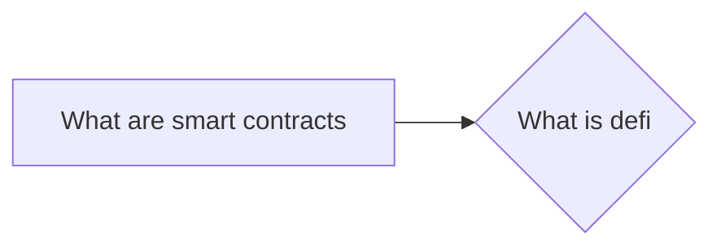

# Prerequisites
[[What_are_Smart_Contracts]]

# Subgraph

# Description
  
Defi stands for decentralized finance and is a term used to describe a new category of financial applications that operate on the blockchain. These applications allow users to interact with financial instruments in a decentralized manner removing the need for a third party. Defi applications are built on top of decentralized protocols such as Ethereum and allow users to interact with a variety of financial instruments including loans derivatives and insurance products.

# Links
Links to other educational resources here: