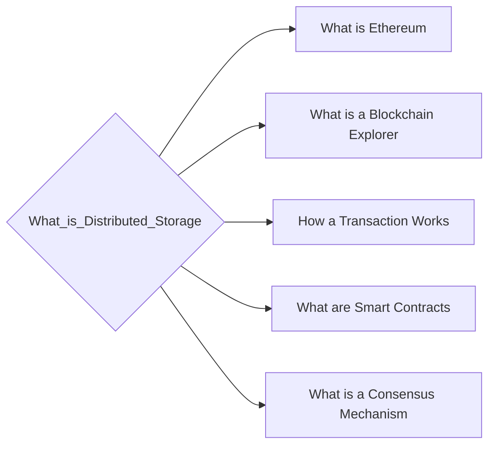

# Prerequisites
None

# Subgraph

# Description
Distributed storage is a term used in the cryptocurrency world to describe a storage solution that is not centralized. This means that the data is not stored on a single server or location but is instead spread out across a number of different servers. This makes it more difficult for someone to hack into the system and steal the data.

# Exercises
- Look into Torrenting and how it works.
- Optional: Torrent something. Watch how as you connect to the network you discover more peers. Watch how the file comes in one little section at a time. (not recommending you download anything illegal maybe just grab a copy of Ubuntu)

# Links
Links to other educational resources here: