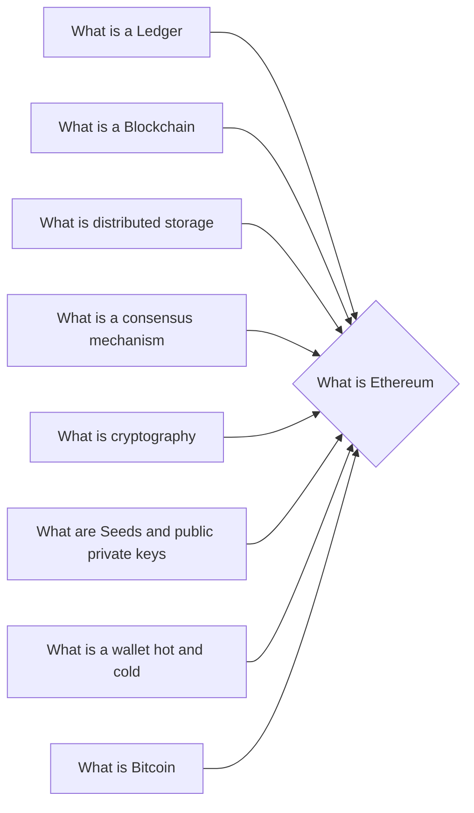

# Prerequisites
[[What_is_a_Ledger]]

[[What_is_a_Blockchain]]

[[What_is_Distributed_Storage]]

[[What_is_a_Consensus_Mechanism]]

[[What_is_Cryptography]]

[[What_are_Seeds_and_Public_Private_Keys]]

[[What_is_a_Wallet]]

[[What_is_Bitcoin]]

# Subgraph

# Description
Ethereum is a decentralized platform that runs smart contracts: applications that run exactly as programmed without any possibility of fraud or third party interference. [[What_are_Smart_Contracts]] Ethereum is powered by the Ether token.

# Links
Links to other educational resources here: