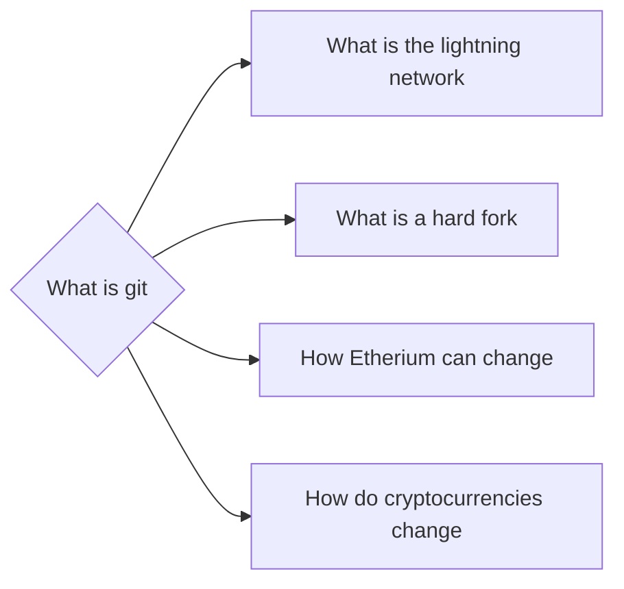

# Prerequisites
None

# Subgraph

# Description
git is a distributed revision control and source code management system with an emphasis on speed. Git was designed for Linux kernel development and was originally developed by Linus Torvalds.

# Exercises
- Watch a video on what git is.
- If you havent already make an account on GitHub.
- Navigate back to this repository (https://github.com/lpurdy01/crypto-knowledge-map) and create a fork under your account.
- (Assuming you are on Windows) download git desktop and clone these notes to your computer. 
- If you had them before delete them and just start editing the notes from the new location. 
- Add something to the notes use git desktop to commit the changes and push the changes.
- Navigate to your fork of the repository go to the Insights tab then the Network category. Click on the commit you just pushed and look at how the changes are recorded.

# Links
Links to other educational resources here:

What is GIT? Explained in 2 Minutes! https://www.youtube.com/watch?v=2ReR1YJrNOM
