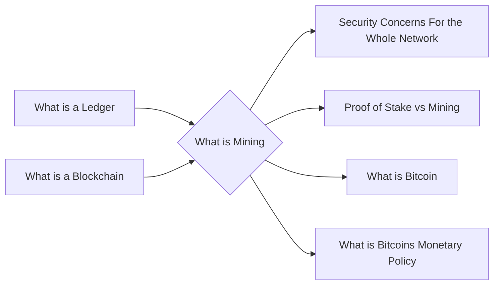

# Prerequisites
[[What_is_a_Ledger]]

[[What_is_a_Blockchain]]

# Subgraph

# Description
Mining is the process of verifying and adding new transactions to the blockchain. Miners are rewarded with cryptocurrency for their efforts.

# Links
Links to other educational resources here: