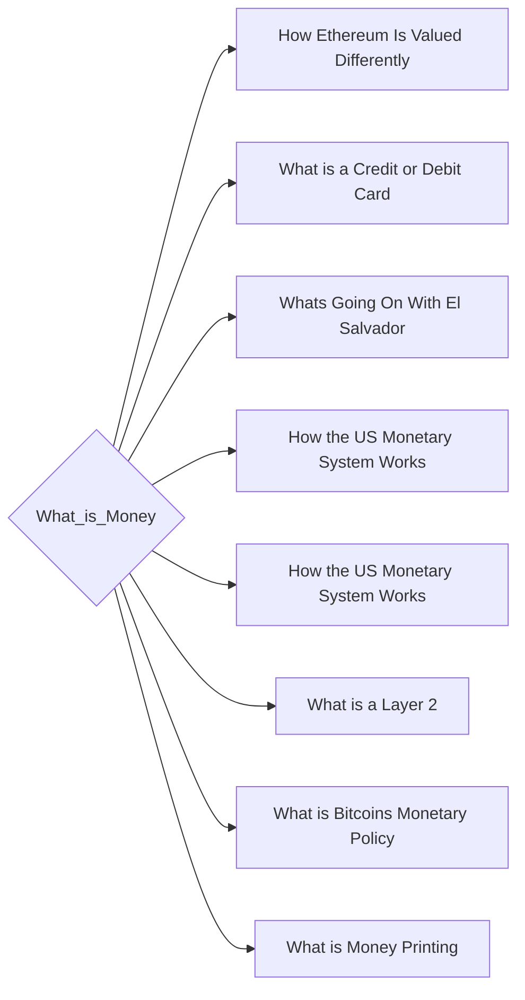

# Prerequisites
None

# Subgraph

# Description
Money is a medium of exchange that is used to purchase goods and services. It is also used to store value. Money is typically paper currency or coins.

# Exercises
- Look into a history of what people have used for money. How shells coins beads ect... have been chosen through history.
- Look into the property of a currency called its "hardness". Specifically looking for the version of hardness that refers to the difficulty to make more of the currency.
- Why do people choose to use a particular currency in a region?

# Links
Links to other educational resources here:
