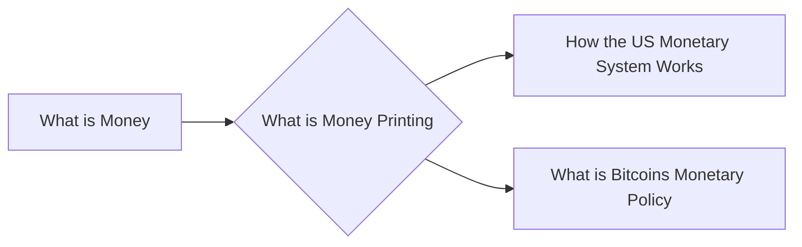

# Prerequisites
[[What_is_Money]]

# Subgraph

# Description
  
Money printing is the process of creating new money. This is usually done by a government by issuing new currency or by increasing the money supply.

# Links
Links to other educational resources here:
