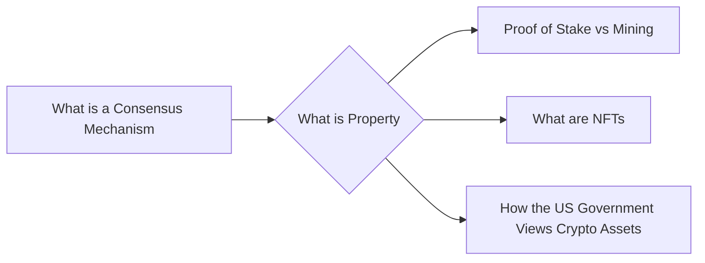

# Prerequisites
[[What_is_a_Consensus_Mechanism]]

# Subgraph

# Description
Property is a legal term that refers to anything that has value and can be owned. Property can be tangible such as a house or car or intangible such as intellectual property such as a patent or copyright. Property is usually classified into two categories: real property and personal property. Real property refers to land and anything built on attached to or growing on it such as a house or a tree. Personal property refers to everything else such as a car or a piece of.

# Links
Links to other educational resources here: