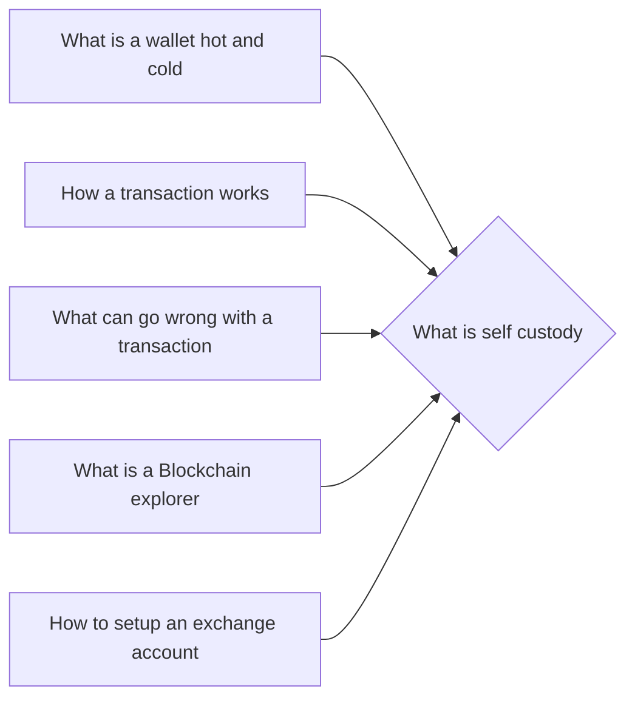

# Prerequisites
[[What_is_a_Wallet]]

[[How_a_Transaction_Works]]

[[What_Can_Go_Wrong_With_a_Transaction]]

[[What_is_a_Blockchain_Explorer]]

[[How_to_Setup_an_Exchange_Account]]

# Subgraph

# Description
  
Self custody is the act of holding and managing your own cryptocurrency assets. This can be done through a variety of methods such as a digital wallet a hardware wallet or a paper wallet. By taking control of your own assets you can avoid the need to trust a third party with your funds.

# Links
Links to other educational resources here: