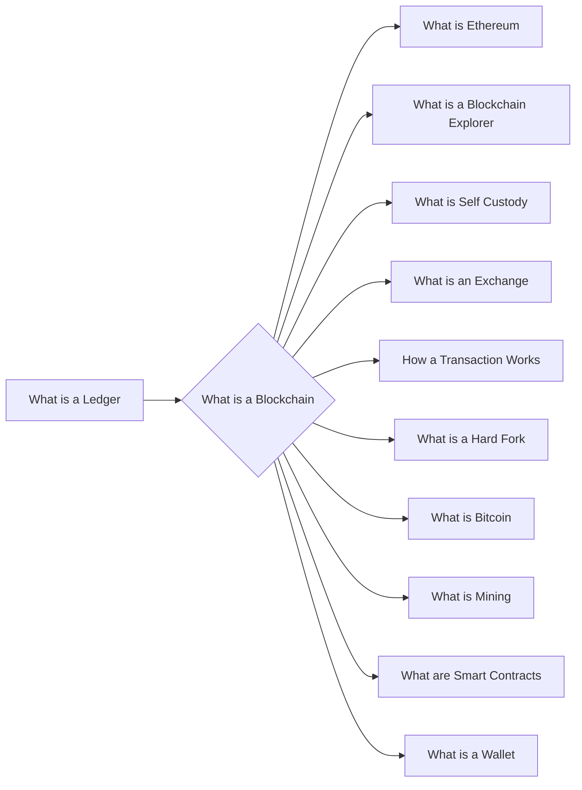

# Prerequisites
[[What_is_a_Ledger]]

# Subgraph

# Description
A blockchain is a digital ledger of all cryptocurrency transactions. It is constantly growing as "completed" blocks are added to it with a new set of recordings. Each block contains a cryptographic hash of the previous block a timestamp and transaction data. Bitcoin nodes use the block chain to differentiate legitimate Bitcoin transactions from attempts to re-spend coins that have already been spent elsewhere.

# Links
Links to other educational resources here: