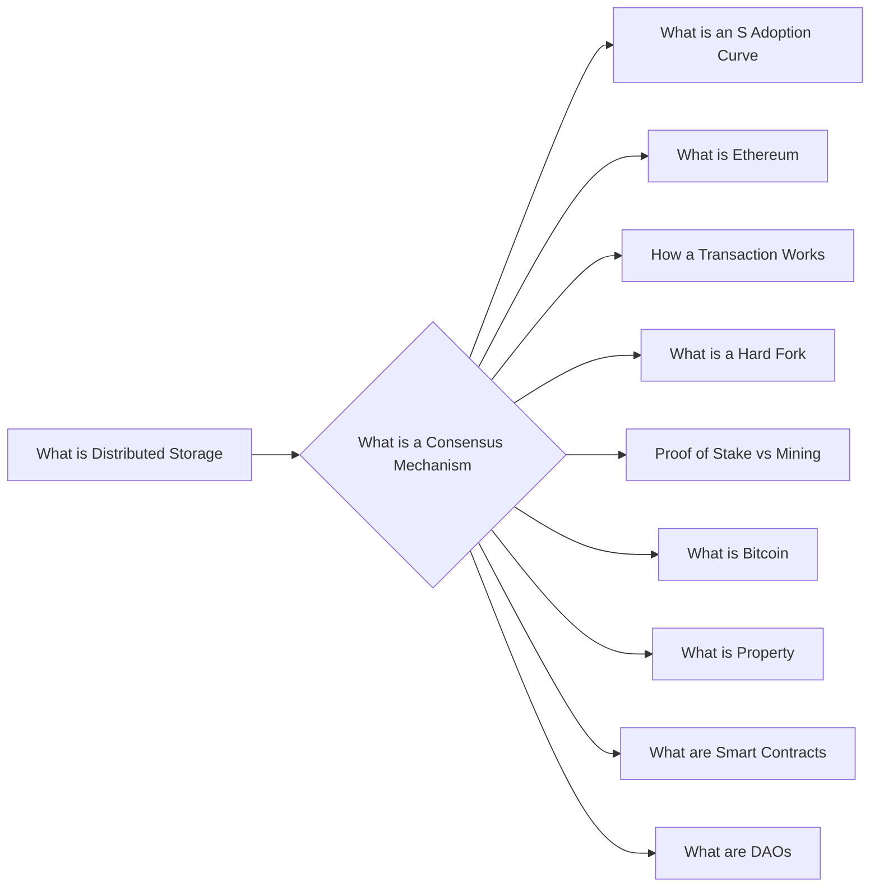

# Prerequisites
[[What_is_Distributed_Storage]]

# Subgraph

# Description
A consensus mechanism is a process used to achieve agreement on a single data value among distributed systems.

# Links
Links to other educational resources here: