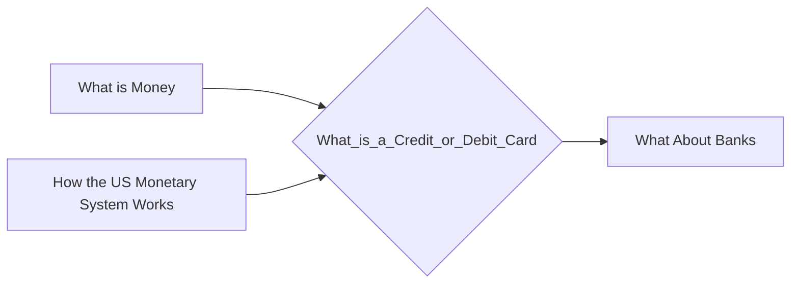

# Prerequisites
[[What_is_Money]]

[[How_the_US_Monetary_System_Works]]

# Subgraph

# Description
  
A debit card allows customers to spend money by drawing on funds they have already deposited in the bank. Credit cards allow consumers to borrow money up to a certain limit in order to purchase items or withdraw cash.

# Links
Links to other educational resources here: