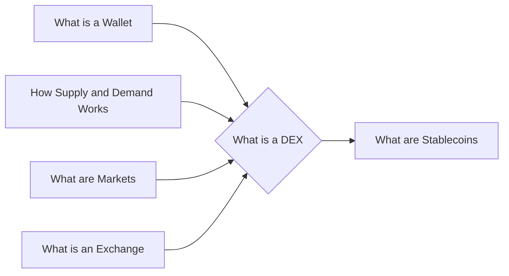

# Prerequisites
[[What_is_a_Wallet]]

[[How_Supply_and_Demand_Works]]

[[What_are_Markets]]

[[What_is_an_Exchange]]

# Subgraph

# Description
  
A decentralized exchange or DEX is a cryptocurrency exchange that is not controlled by any single entity. Instead it is run by a network of users who all have a stake in the exchange. This makes it more secure and less likely to be hacked than traditional exchanges. DEXs also typically have lower fees than traditional exchanges.

# Links
Links to other educational resources here:
