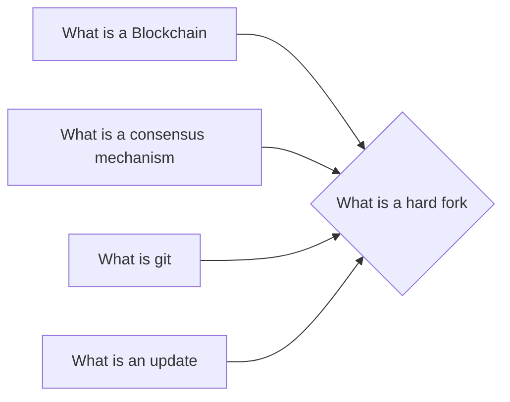

# Prerequisites
[[What_is_a_Blockchain]]

[[What_is_a_Consensus_Mechanism]]

[[What_is_GIT]]

[[What_is_an_Update]]

# Subgraph

# Description
  
A hard fork is a software upgrade that introduces a new rule to the network. This rule is not compatible with the old software so a hard fork creates a new blockchain and a new currency.

# Links
Links to other educational resources here: