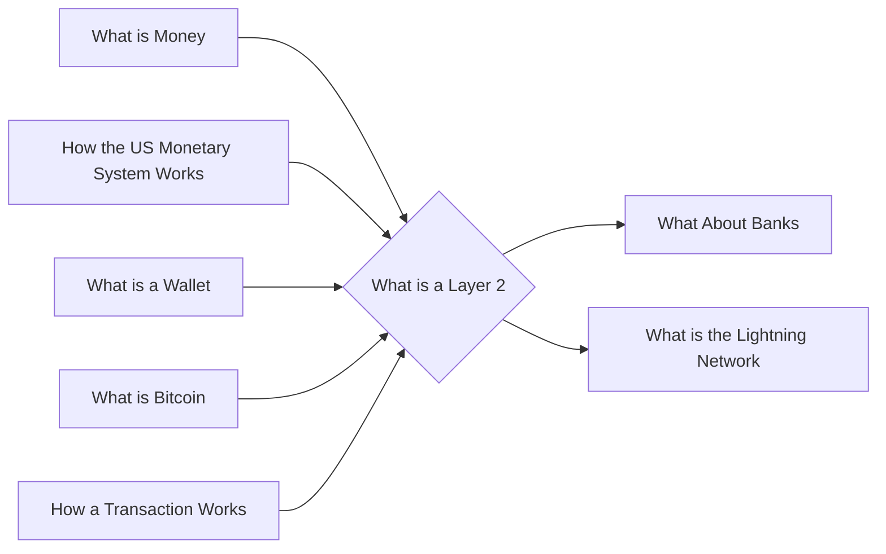

# Prerequisites
[[What_is_Money]]

[[How_the_US_Monetary_System_Works]]

[[What_is_a_Wallet]]

[[What_is_Bitcoin]]

[[How_a_Transaction_Works]]
# Subgraph

# Description
A layer 2 protocol is a protocol that sits on top of a layer 1 protocol and provides additional features. Bitcoin is a layer 1 protocol and the Lightning network is a layer 2 protocol that builds on top of Bitcoin. Layer 2 protocols can be used to add features to a cryptocurrency or to improve the performance of a cryptocurrency.

# Links
Links to other educational resources here: