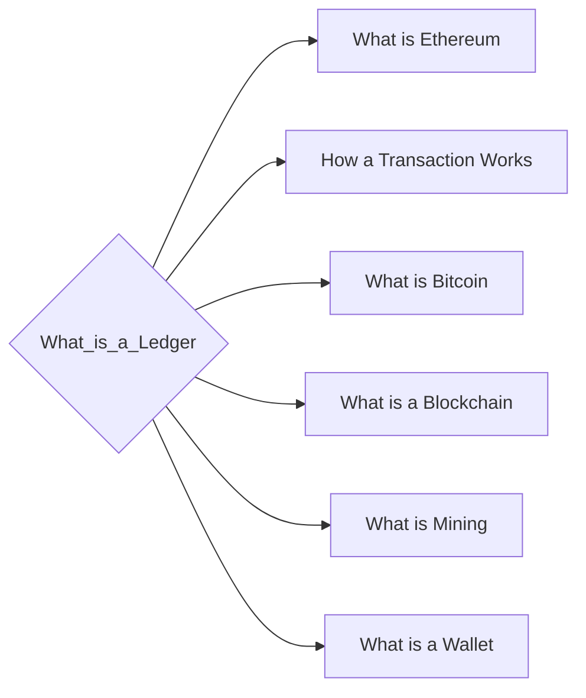

# Prerequisites
None

# Subgraph

# Description
A ledger is a record of financial transactions. Cryptocurrencies use a distributed ledger which is a database that is shared by all nodes participating in a network. Transactions are verified by consensus of the participants in the network. This distributed ledger is used to record transactions and to track the ownership of digital assets.

# Exercises
- Optional: make a little ledger on a piece of paper. Have Jack Jill Carly and Bob exchange some money and the calculate how much money each of them has.

# Links
Links to other educational resources here: