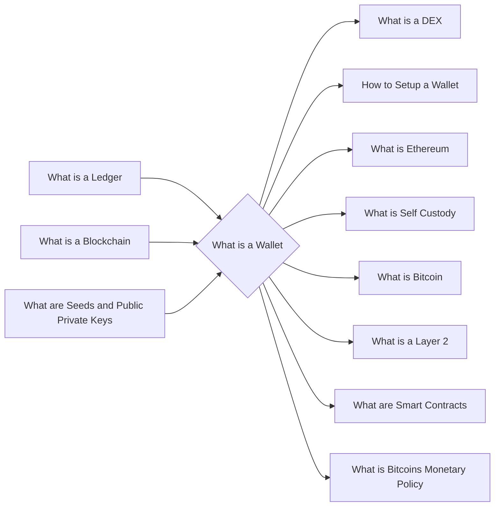

# Prerequisites
[[What_is_a_Ledger]]

[[What_is_a_Blockchain]]

[[What_are_Seeds_and_Public_Private_Keys]]

# Subgraph

# Description
A wallet is a software program that stores private and public keys and allows users to send and receive digital currency and monitor their balance. Wallets can be either hot or cold. Hot wallets are connected to the internet while cold wallets are not.

# Links
Links to other educational resources here: